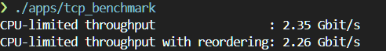

## 项目准备

可以参考 [CS144 VM 配置指南](https://web.stanford.edu/class/cs144/vm_howto)

较为简单的方式是租云服务器，Ubuntu 22.04 LTS 版本下的GCC编译器(11.4)就可跑起来该项目，然后采用vscode + cmake + remote ssh 的方式编码。

项目环境：
- gcc 11.4
- lsp clangd 18.1.8(不用太新，14的版本够用)

## 构建项目

```shell
cd <project-path>
cmake -B build
cmake --build build --target all -j4
```

## 测试

```shell
cd ./build
make check_lab<序号>
```

## 使用课程提供的tcp_benchmark

```shell
./app/tcp_benchmark
```

我这里在Release变量下构建可执行文件的结果：

