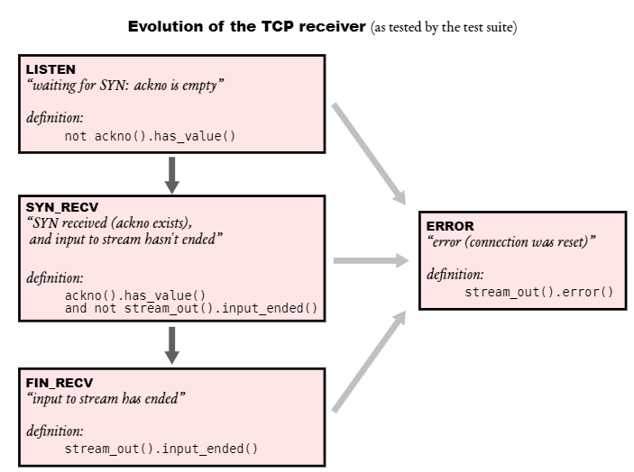
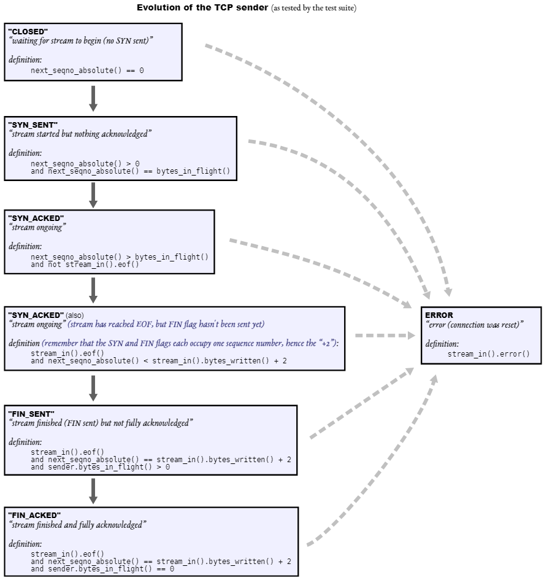

Lab 4 Writeup
=============

My name: [your name here]

My SUNet ID: [your sunetid here]

I collaborated with: [list sunetids here]

I would like to thank/reward these classmates for their help: [list sunetids here]

This lab took me about [n] hours to do. I [did/did not] attend the lab session.

Program Structure and Design of the TCPConnection:

[]

Implementation Challenges:
[]

Remaining Bugs:
[
    从 segments_out() 中获取 seg 使用了auto && 的方式获取，而 auto && 是一种基于推导的方式，实际是一种万能引用，并不实际构造对象，我们在这里其实需要的是移动构造，而不是引用
]

- Optional: I had unexpected difficulty with: [describe]

- Optional: I think you could make this lab better by: [describe]

- Optional: I was surprised by: [describe]

- Optional: I'm not sure about: [describe]
